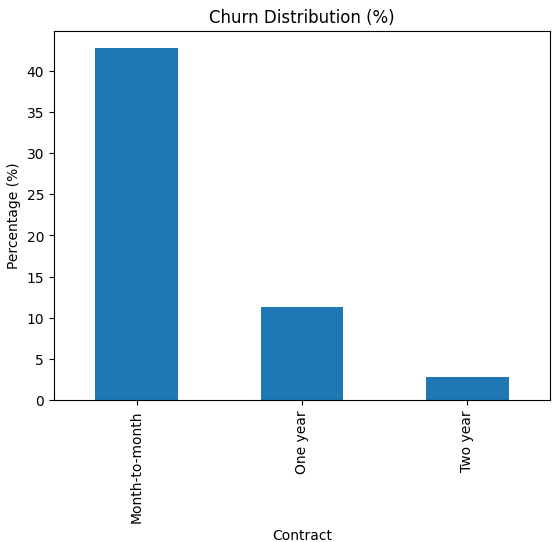
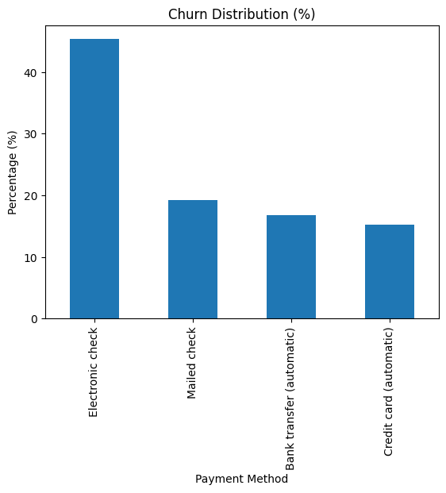
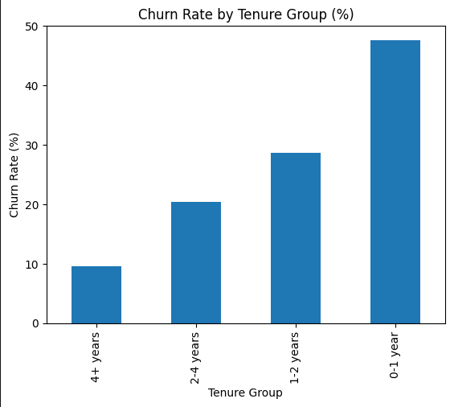

# Telco Customer Churn

## ❓ Business Problem
In this project, we used a dataset from a fictional telecommunications company to analyze customer churn rates. The main question addressed is how the company can develop strategies to reduce customer churn.

To answer this question, several analyses were conducted to identify the profile of customers who cancel their services, considering factors such as age, subscribed services, contract duration, payment method, and other relevant variables.

## 📊 Dataset 
This project uses a dataset from a fictional telecommunications company containing 7,043 rows and 21 columns.

The dataset includes information about customers who left within the last month, represented by the Churn column.

It also contains information about subscribed services, such as phone service, multiple lines, internet service, online security, online backup, device protection, tech support, and streaming TV and movies.

In addition, the dataset provides customer account information, including contract type, payment method, paperless billing, monthly charges, total charges, and customer tenure.

Demographic information is also included, such as gender, age range, and whether customers have partners or dependents.

The dataset can be found at:
 https://www.kaggle.com/datasets/blastchar/telco-customer-churn.

Before the analysis, data cleaning and preprocessing procedures were performed.

## 🛠️ Methodologies and Tools
After cleaning the data, the analysis initially focused on individual variables.

First, the overall churn rate was analyzed and proved to be concerning. Then, the individual impact of several variables on churn was studied, including payment method, contract type, subscribed services, and customer age.

Afterward, a multivariate analysis was performed to evaluate the combined influence of payment method and contract type. This analysis helped identify the customer segment with the highest churn risk: customers with month-to-month contracts and non-automatic payment methods.

The next step of the analysis involved creating new variables to better understand customer behavior. Two new columns were added to the dataset:

- TotalServices, which calculates the total number of subscribed services.

- TenureGroup, which categorizes customers according to contract duration ranges, such as 0–1 year, 2–3 years, and so on.

## ⚙️ Technologies Used

- Python
- Pandas
- NumPy
- Matplotlib
- Seaborn
- Jupyter Notebook

## Main Insights and Results
The analysis generated several important insights.

Customers with month-to-month contracts showed the highest churn rate, around 42%, while long-term contracts significantly reduced churn rates, especially two-year contracts, which presented a churn rate of approximately 3%.

Payment method also proved to be a strong indicator of churn behavior. Customers using electronic check had a considerably higher churn rate, around 45%, compared to customers using automatic payment methods such as credit cards or bank transfers, whose churn rates ranged between 15% and 17%.

Furthermore, the combination of month-to-month contracts and electronic check payments represented the customer segment with the highest risk of churn, with cancellation rates exceeding 50%.

Another important finding was that customers in their first year of service had a significantly higher churn rate, reaching 47.7%. This rate steadily decreased as customer tenure increased. Customers with more than four years of tenure demonstrated strong retention, with churn rates of only 9.5%.

Based on these results, it can be concluded that newer customers are more likely to cancel their plans. Their initial experience may be negatively affected by the lack of automated payment methods and the inconvenience of manual monthly payments, factors that can generate dissatisfaction and eventually lead to churn.

Therefore, the company’s strategies to reduce churn should focus on improving the onboarding process and enhancing the early experience of new customers, especially during their first months using the service.

## Visualization

### Churn per contract

### Churn per Payment Method

### Churn per Tenure Group

## 📌 Conclusion

The analysis showed that customer churn is strongly associated with short-term contracts and non-automatic payment methods. In addition, newer customers presented significantly higher churn rates, indicating that the first months of service are a critical period for customer retention. Improving the onboarding experience, simplifying payment processes, and encouraging long-term contracts could significantly reduce churn rates.

## Contact 
Renan Sampaio   

[LinkedIn](https://www.linkedin.com/in/renan-barreto-sampaio-a612771bb)
